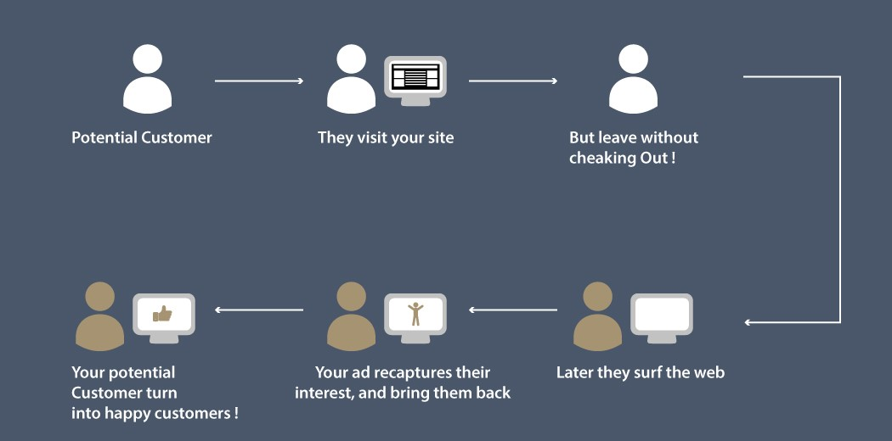

# Ad Click Probability Prediction

# Problem Statement
Zbay is an E-commerce website which sells a variety of products at its online platform. Zbay records user behaviour of its customers and stores it as a log. However, most of the times, users do not buy the products instantly and there is a time gap during which the customer might surf the internet and maybe visit competitor websites.

Now, to improve sales of products, Zbay has hired Adiza, an Adtech company which built a system such that ads are being shown for Zbay’s products on its partner websites.

If a user comes to Zbay’s website and searches for a product, and then visits these partner websites or apps, his/her previously viewed items or their similar items are shown on as an ad. If the user clicks this ad, he/she will be redirected to the Zbay’s website and might buy the product.

In this problem, the task is to predict click probability i.e. probability of user clicking the ad which is shown to them on the partner websites for the next 7 days on the basis of historical view log data, ad impression data and user data.

Provided with the view log of users (2018/10/15 - 2018/12/11) and the product description collected from the Zbay website.

Train data contains the impression logs during 2018/11/15 – 2018/12/13 along with the label which specifies whether the ad is clicked or not. Model will be evaluated on the test data which have impression logs during 2018/12/12 – 2018/12/18 without the labels.

[Click to view the project](https://github.com/rsaadiq/ad_click_probability/blob/master/WNS.ipynb)
